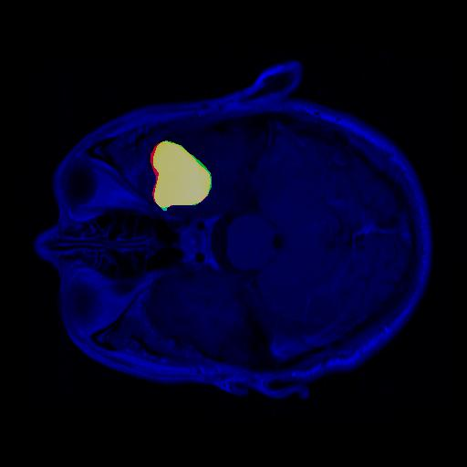
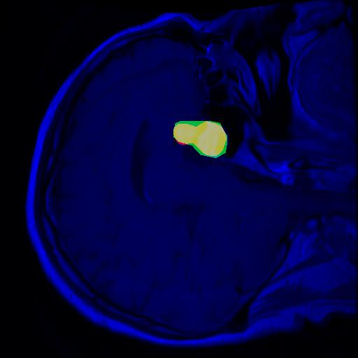
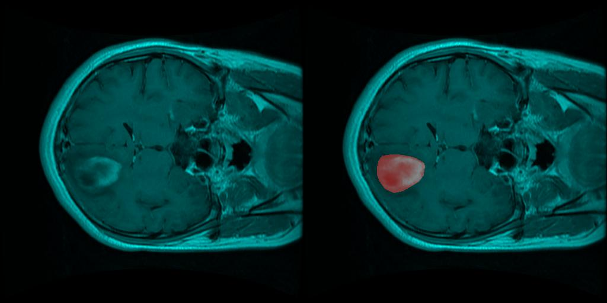
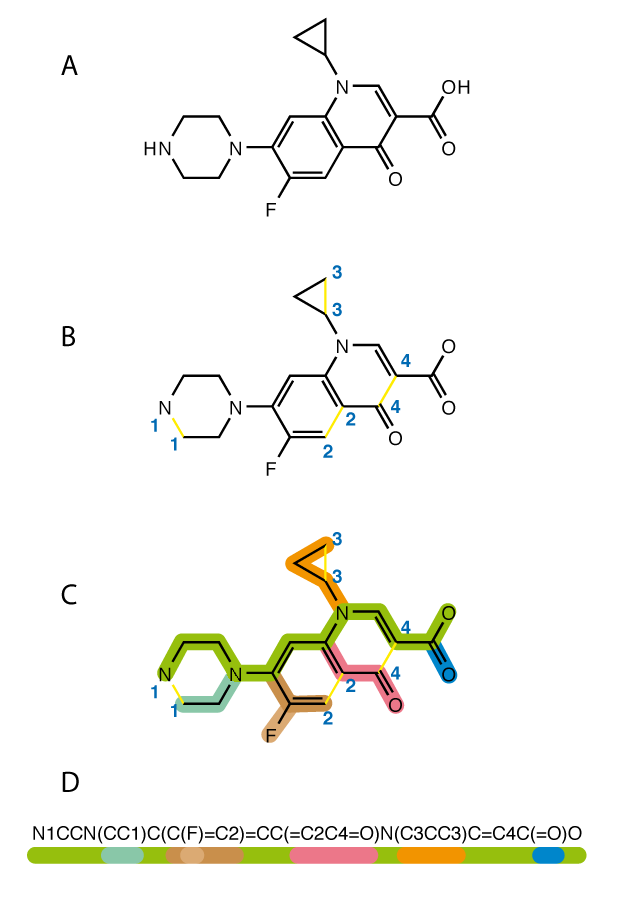

# Experiments
## MRI Image
* Brain tumor type [classifications and feature visualization](tumor_type_classification_and_its_implications.html) using MRI images (T1 enhanced open dataset)
* Brain tumor [region prediction](region_prediction.html) using MRI images (T1 enhanced open dataset)
  
## Chemicals
* [SMILES string](https://en.wikipedia.org/wiki/Simplified_molecular-input_line-entry_system) precict mutagenecity (one of the toxity), [prediction on CKB drugs](toxity_prediction_ames.html)
