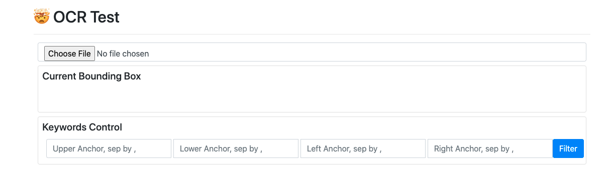
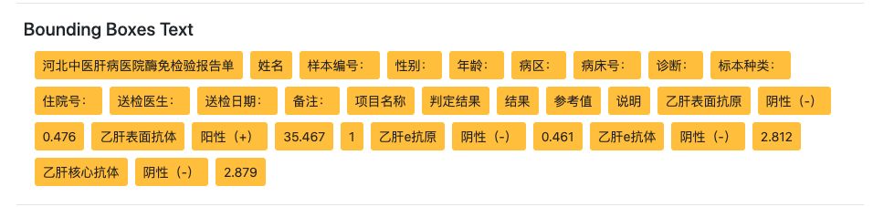
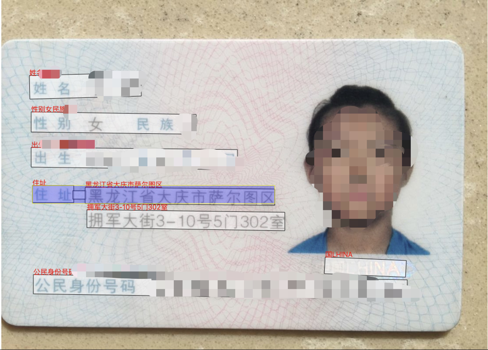
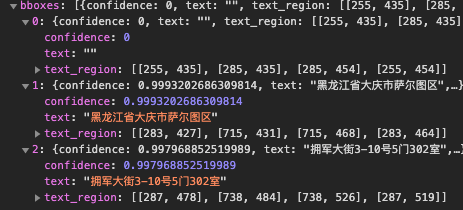
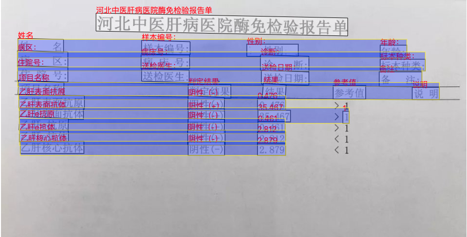
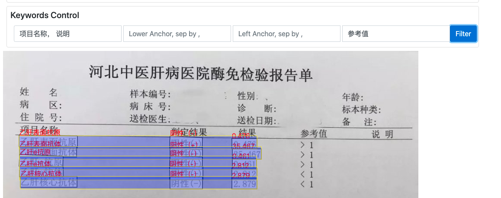
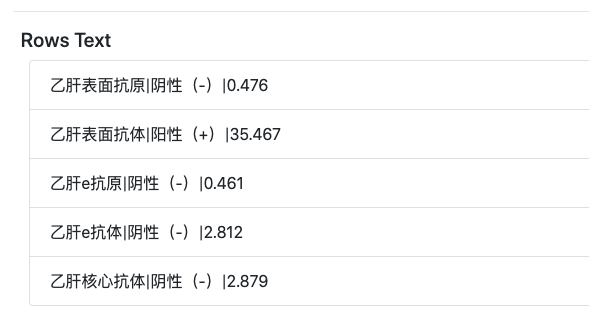

# OCR Tab
> 把图片里的表格搬进您的数据库，一款极易定制文字识别后续应用

## 测试页面
> [点此访问](http://ec2-52-83-78-143.cn-northwest-1.compute.amazonaws.com.cn:8050/static/html/test_ocr.html)测试页面， 如果没有权限请找领星生物的人员帮您开通



## OCR 接口
* 访问路径 ```http://[host]:[port]/ocr```
* 请求方式 ```POST```
* Payload 数据种类 ```application/json```
* Payload 数据格式, 其中字符串值为JPEG图片数据的base64编码
```json
{"images":["/9j/4AAQS..."]}
```
* 返回格式
```json
{
    "msg":"",
    "result":[
        [
            {
                "confidence":0.9909,
                "text":"XX医院化验单",
                "text_region":[
                    [34,104],
                    [138,107],
                    [138,139],
                    [34,137]
                ]
            },
            {
                "confidence":0.991,
                "text":"生化室",
                "text_region":[
                    [14,154],
                    [239,217],
                    [237,259],
                    [32,27]
                ]
            },
            ...
        ]],
    "status":"0"
}
```
### 获得的Bouding box
一般OCR接口能返回一堆Bounding box，其中一个box案例如下
```json
{
                "confidence":0.9909,
                "text":"XX医院化验单",
                "text_region":[
                    [34,104],
                    [138,107],
                    [138,139],
                    [34,137]
                ]
}
```

* text: box中的文本
* text_region: box四个角的x 和y的像素坐标， 如左上角的坐标即是```(从左到右第34个像素, 从上到下第104个像素)```
* confidence: 置信度， 0~1之间的浮点数， 数字越大置信度越高

## 信息的提取和筛选
在OCR完成后， 您能获得的仅仅是一堆有x, y 坐标的散乱的Bounding box, 而许多项目往往需要更精确的筛选和提取。


### 案例：比如身份证的OCR结果中，您想要提取住址


### 为什么不能根据关键词筛选需要的信息？
多数时候， 您无法使用关键词筛选， 住址的信息从来不包含“住址”两个字， 也无法确定一定包含什么， 而且这一例中的住址有两个框， 肯定有一个不包含“省”和“市”。 

### 为什么不通过x,y 位置直接定位到我们要的结果？
扫描时把身份证放入扫描窗口的左上角还是右下角对结果的影响很大， 位置的绝对值和百分比坐标都无法精确定位

### 一个比较靠谱的解决方案
我们可以依靠bounding box们和周边关键词进行筛选， 比如:
* 我们可以确定这个信息在```"住址"```的右边，
* ```"出生"```的下方，
* 如果扫描质量够好， 还能隐约读出CHINA， 那我们就按照```"INA"```来算， 同时在```"公明身份证号"```和```"INA"```的上方

无论身份证的位置怎么动， 都能自动定位到我们想要的信息， 只要身份证格式不变， 这样的任务就能大规模自动化🚀



过滤后只剩三段文本，直接衔接起来就是我们想要的结果

### 接口细节

* 访问路径 ```http://[host]:[port]/filter_anchors```
* 请求方式 ```POST```
* Payload 数据种类 ```application/json```
* Payload 数据格式
```json
{
    "bboxes":[
        {...},{...},...,{...}
    ],
    "anchors":{
        "upper":"出生",
        "left":"住址",
        "right":null,
        "lower":"公明身份证号,INA"
    }
}
```
- bboxes: OCR接口返回的那堆bounding box们
- anchors: 能划出上下左右边界的关键词， 如果没有命中则不进行筛选
* 返回格式: 返回的结果会过滤掉所有在边界外的box们（包括边界）
```json
{"bboxes":[
    {...},{...}
]}
```

## 化验单=>表格数据
> 提炼好的表格数据对于后期工程总是友好的， 可以自由自在地查询/筛选/加总计算等， 而一堆化验单图片则不能达到同样的效果。 这里我们提供一个轻松提炼表格数据的解决方案

### 假设我们要提前这个化验单的结果数据
> 通常这样的扫描文件， 数据位置不确定， 行数也不确定



### 前置步骤
先过滤走用不着的数据， 参考[之前提到的筛选功能](https://genomicare.github.io/docs/docs/ocrtab/#%E4%BF%A1%E6%81%AF%E7%9A%84%E6%8F%90%E5%8F%96%E5%92%8C%E7%AD%9B%E9%80%89)，以 "项目名称,说明"为上边界， 以"参考值"为右边界， 我们可以大大缩小数据范围



### 行对齐接口
我们可以用行对齐工具将处在同一行里的数据划分为到一组，结果预览如下，这样的文本格式就能很容易的用代码/excel/数据库等方式存储和编辑.



* 访问路径 ```http://[host]:[port]/align_rows```
* 请求方式 ```POST```
* Payload 数据种类 ```application/json```
* Payload 数据格式
```json
{
    "bboxes":[
        {...},{...},...,{...}
    ],
    "threshold":0.6
}
```
- bboxes: OCR接口返回的那堆bounding box们
- threshold: 纵向的重合度， 两个box在纵向上一般不会完全像素级的重合， 这个threshold即是两个box重合部分的百分比， 数字越小， 越能适应倾斜， 但也更容易错行

* 返回格式:
```json
{
    "groups":[
        {
            "bbidx":[0,1,2],
            "borders":{"x1": 37, "x2": 587, "y1": 197, "y2": 227},
            "boxes":[{...},{...},{...}],
            "text":"乙肝表面抗原|阴性（-）|0.476"
        },
        {...},
        ...
    ]
}
```
- groups: 分组， 一组即是一行
    - boxes: 这一行所包含的box们， 按从左到右顺序
    - bbidx: boxes对应的从0开始数的标号
    - borders: 整个一行作为一个大的box的坐标， x1 x2是上下两条边， y1, y2分别是左右
    - text: 这一行按照```"|"```合并的文本

## 本产品局限性
> 一般来说， 整洁干净清晰的扫描结果不会出现问题， 目前的OCR技术读取印刷体只要清晰就很少会错

### OCR 本身的局限性
* 如果字太密太小， 比如整页整页的连续文本（如小说）， OCR可能会发生漏判
* 图像太模糊

### 提炼和表格抓取的局限性
* 图片过于倾斜、扭曲
* 如果OCR这一步读错字了， 我们也就无法用相关关键字作为边界了
* 如果表格上有污渍， 额外的手写备注，被读成字符，可能会破坏行/列的预测