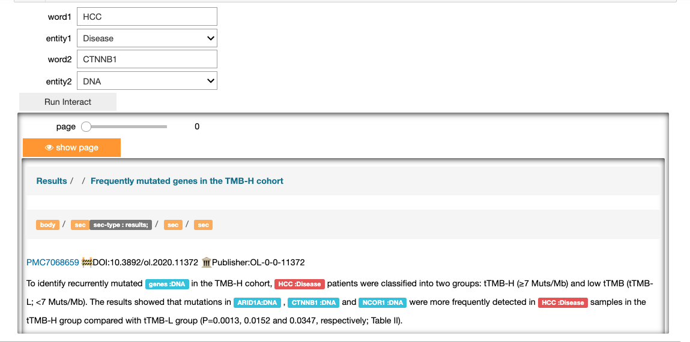

# Interim Progress (II)
> 2021.07.01 - 2021.12.31

## Project
### CAS
#### Productionized System

##### Frontend Application
* NER Tagging System

* Entity Aligning

* Multiple versions of graph database demo

##### AI
* NER model, frontend & API

* Neural Text Search
* Relation Search by Target

* Mesh Classifier, Author recommender

##### Cloud Computing
* [Nebulium](https://github.com/genomicare/nebulium), fast deploy containerized data science application on AWS, using jupyter

##### Smart Database
* Clickhouse(191) big data system
* Reactome => with Neo4J

### Everest
* [x] Using gene/protein (target) to search for clinical trials
* [ ] Didn't pull off "Using gene/protein (target) to generates statistical reports", not applicable requests

### Others
#### Data Curating
* PMC full article / updated automatically
    * Paragraphed, traceable
    * NERed
    * Discriminated text: table data, reference data, figure description etc.
    * Figure Search by Target, Thumbnails Story view

* A stable PDF converter
* Clinical trial: prototyping => hand over to LiJM
* CheBI
* DrugBank
* Uniprot

#### Experiments
* Amino Acid Sequence => Cell RNA Transcriptome
* Large pretrained Roberta for Medical/Biology NLP
* GPT J Inference

#### PR attempt
* RWD Planet Knowledge
* CAS meetings offline and online
* Meeting with everest
* Applying for PAR (产学研)'s funding

#### Sourcing
* Meetings with HW Cloud

#### Copywriting®
* The R-API system, a system to create Python API upon R application

# Interim Pregress (I)
> 2021.01.01 - 2021.06.30

### Oceanus+
#### Productionized
* Improved version of blackops

* OCRtab system

### Others
#### Productionized Things
* Sapere Aude system
    * Browswer Extension
    * Audio Dictation

#### Data Curating
* TCGA whole slide images 1.9T/2153 slides (All we can get)
* TCGA tables cleaned out of CSVs

#### Experiments
* Real world data patient screeting for clinical trial with shapley value

* Omni-Paradigm Graph Neural Network Predictor

* Chinese BioMed Segementation

* A [whole slide image slicer](https://github.com/genomicare/durandal), docker image [here](https://hub.docker.com/r/raynardj/durandal)

#### PR attempt
Both well received
* Genomicare Training on data automation

* [CAS session on big data/NLP for researching](https://mp.weixin.qq.com/s/F-j3tBrd9wh0Fhjt2660XA)
